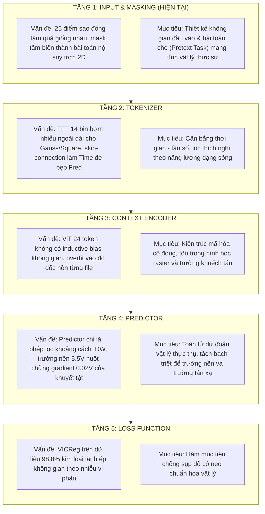

# PECT-JEPA: Lộ Trình Tái Thiết Lập Hệ Thống (Systematic Re-foundation Roadmap)

**Tài liệu theo dõi quá trình tái cấu trúc kiến trúc từng tầng**  
*Mã tài liệu: `DOC-ROADMAP-2026-V1`*  
*Trạng thái: ĐANG THỰC HIỆN - BƯỚC 1 (INPUT & MASKING)*  
*Mục tiêu tối thượng: Xây dựng Mô hình Nền tảng Tự giám sát Thực sự cho PECT, thoát khỏi bẫy làm trơn không gian 2D, giải quyết bài toán Định cỡ Vật lý và Thích ứng Đa điều kiện.*

---

## 1. Tôn Chỉ & Nguyên Tắc Thực Thi Nghiêm Ngặt

1. **Tuân thủ Thứ tự Từng Tầng (Strict 5-Stage Sequential Protocol)**:
   - Quá trình nghiên cứu và tái cấu trúc bắt buộc phải đi tuần tự qua 5 tầng:
     $$\mathbf{Tầng\ 1:\ Input\ \&\ Masking} \longrightarrow \mathbf{Tầng\ 2:\ Tokenizer} \longrightarrow \mathbf{Tầng\ 3:\ Encoder} \longrightarrow \mathbf{Tầng\ 4:\ Predictor} \longrightarrow \mathbf{Tầng\ 5:\ Loss\ Function}$$
   - **Tuyệt đối không nhảy cóc**: Không sửa Tokenizer hay Loss khi bài toán Input & Masking chưa được định nghĩa hoàn chỉnh và kiểm chứng thực nghiệm.
   - **Cô lập tác động (Ablation Isolation)**: Khi thay đổi một tầng, tất cả các tầng còn lại phải được giữ cố định ở cấu hình baseline để cô lập chính xác nguyên nhân - kết quả.

2. **Quy chuẩn Luận cứ Khoa học (Evidence-Grounded Scientific Rigor)**:
   - Mọi đề xuất thay đổi cấu trúc ở từng tầng bắt buộc phải có đầy đủ 3 yếu tố:
     1. **Luận điểm (Claim)**: Giả thiết toán học hoặc cơ chế vật lý cần kiểm chứng.
     2. **Luận cứ (Rationale)**: Phương trình toán, cơ chế khuếch tán dòng xoáy hoặc động lực học tối ưu giải thích tại sao thay đổi này giải quyết được vấn đề, đồng thời phân tích rõ ràng những gì phải đánh đổi (trade-offs, chi phí tính toán, bộ nhớ VRAM).
     3. **Minh chứng (Empirical Evidence)**: Chạy thực nghiệm tối thiểu 3 epochs, đánh giá trên toàn bộ 57 file test held-out theo quy chuẩn `docs/PECT_JEPA_V_NEXT_SPECIFICATION.md` (Sham Null, không lọc bỏ file), đo đạc không gian ẩn (Two-NN, SVD rank, tương quan gradient) trước khi kết luận chấp nhận hay bác bỏ.

3. **Ghi nhớ Không Thể Quên (The Irreversible Lessons)**:
   - **Bẫy nội suy 2D (The 2D Inpainting Trap)**: Che 1 điểm tâm và đoán từ viền trong cùng một patch phẳng $98.8\%$ lành chỉ biến mô hình thành một bộ lọc làm trơn không gian (Spatial Smoothing Spline). Nó phát hiện dị thường vì khuyết tật phá vỡ tính trơn, nhưng hoàn toàn mù về độ sâu và vật lý dòng xoáy (thua cả hồi quy tuyến tính Ridge 24 đầu dò).
   - **Sự khác biệt 3 dạng sóng**: Gaussian (1000 Hz, băng hẹp), Square (200 Hz, bậc hài lẻ suy giảm), Chirp (500–1500 Hz, quét thời gian = tần số). Không bao giờ áp đặt các phép xử lý chia cắt thời gian (Temporal Slicing) hoặc chia cắt phổ cứng nhắc.
   - **Bản chất đo quét Raster đơn điểm**: Cảm biến là đầu dò điểm đơn lẻ (Single Point Probe) quét cơ học từng milimet. 25 đầu dò không phải là mảng chụp đồng thời (array sensor) và không có tính đối xứng quay tròn (trục $Y$ có nhiễu cơ học gấp 5–6 lần trục $X$).

---

## 2. Bản Đồ 5 Tầng Tái Cấu Trúc (The 5-Stage Architecture Map)

---

## 3. TẦNG 1: NGHIÊN CÚU INPUT & MASKING - TẠO BÀI TOÁN "ĐỦ" VỚI PECT

### 3.1. Phân tích Hiện trạng & Điểm nghẽn Toán học
- **Đầu vào hiện tại**: Một patch $x \in \mathbb{R}^{25 \times 128}$ được trích từ một vị trí $(u, v)$ trên bản quét C-scan $270 \times 270\text{ mm}^2$ với topology sao đồng tâm 3 bán kính $r \in \{1, 3, 7\}\text{ mm}$.
- **Cơ chế Masking hiện tại**: Che probe tâm $p_0$ ($r=0$), dùng 24 probe ngữ cảnh $p_{1..24}$ để dự đoán.
- **Tại sao bài toán này "CHƯA ĐỦ" (Underspecified & Trivial)**:
  1. *Độ tương đồng cực cao giữa các probe*: Trong $98.8\%$ diện tích (kim loại lành), điện áp nền $V(u, v) \approx 5.5\text{ V}$. Biến thiên điện áp giữa tâm $r=0$ và vành $r=1\text{ mm}$ chỉ là vài chục microvolt nhiễu lượng tử hóa ADC.
  2. *Nghiệm tối ưu là phép làm trơn không gian*: Cực tiểu hóa $\|g_\phi(x_{\text{ctx}}) - x_{\text{tgt}}\|_2^2$ dẫn thẳng tới nghiệm nội suy tuyến tính $\hat{x}_0 \approx \sum w_i x_i$. Mạng nơ-ron không cần kích hoạt bất kỳ năng lực biểu diễn phi tuyến hay vật lý nào để đạt loss cực thấp.
  3. *Không có động lực học (Zero Dynamics)*: Tín hiệu tại 25 điểm này được kích thích bởi cùng một xung và ghi nhận cùng một lúc trên một vùng kim loại đồng chất. Không có sự dịch chuyển pha hay biến thiên cấu trúc nào đáng kể giữa chúng ngoại trừ khoảng cách hình học.

### 3.2. Tiêu chí của một Bài toán Tự giám sát "ĐỦ" cho PECT
Một bài toán SSL được gọi là "ĐỦ" cho PECT khi và chỉ khi thỏa mãn đồng thời 4 điều kiện tiên quyết:
1. **Không thể giải bằng phép nội suy tuyến tính cục bộ**: Một bộ lọc làm trơn 2D (Linear Interpolator / Ridge / Bilinear) **không thể** dễ dàng giải được bài toán này.
2. **Khóa chặt vào trường biến thiên vật lý**: Để giải được bài toán, mạng nơ-ron bắt buộc phải nắm bắt được quy luật khuếch tán điện từ (độ sâu thâm nhập, độ trễ pha do độ dẫn $\sigma$ và độ từ thẩm $\mu$).
3. **Thích ứng được trên cả 3 dạng sóng (Waveform-Compatible)**: Không dựa vào các giả định chỉ đúng cho một dạng sóng (như giả định tần số thấp/cao của Chirp hay Gaussian).
4. **Khả thi về mặt phần cứng**: Không làm bùng nổ kích thước tensor đầu vào, vận hành mượt mà trên GPU 4GB VRAM.

### 3.3. Các Hướng Tiếp Cận Đang Nghiên Cứu cho Tầng 1

Dưới đây là các hướng tiếp cận cần được mổ xẻ toán học và kiểm chứng thực nghiệm độc lập:

#### Hướng 1.1: Multi-Scale Patch Inpainting với Khẩu độ Che Lớn hơn Bán kính Tán xạ
- **Cơ chế**: Hiện tại ta chỉ che 1 điểm tâm ($r=0$, diện tích $1\text{ mm}^2$). Trong khi vết tán xạ của khuyết tật có bán kính $R \approx 5 - 7\text{ mm}$.
- **Ý tưởng**: Che toàn bộ một vùng đĩa hình học lớn (ví dụ: che toàn bộ tâm và vòng $r=1\text{ mm}$ gồm 9 probes, hoặc che một nửa cung tròn), buộc mạng nơ-ron phải dự đoán từ các probe ở xa ($r=7\text{ mm}$), vượt qua vùng tương quan cục bộ tầm ngắn.
- **Câu hỏi cần trả lời**: Liệu việc che 9/25 probes có làm bài toán quá khó đối với kim loại lành, hay ép mạng phải học trường gradient nền quy mô lớn?

#### Hướng 1.2: Dual-Patch Context (Sound-Metal Reference Anchor)
- **Cơ chế**: Thay vì một patch 25 probe đơn độc, đầu vào gồm 2 phần:
  1. Patch mục tiêu $P_{\text{local}}(u, v)$ tại vị trí đang kiểm định.
  2. Patch tham chiếu chuẩn $P_{\text{ref}}$ được trích từ một vùng kim loại lành đã biết của cùng bản quét (hoặc trung bình động của các vùng có phương sai thấp).
- **Ý tưởng**: Bài toán dự đoán sự sai khác tương đối giữa $P_{\text{local}}$ và $P_{\text{ref}}$, triệt tiêu hoàn toàn sự phụ thuộc vào offset phần cứng của cảm biến.

#### Hướng 1.3: Causal Wavefront / Scan-Direction Masking (Che theo Chiều Di chuyển Bàn Quét)
- **Cơ chế**: Dữ liệu được thu thập theo các vệt quét cơ học trục $X$ và bước nhảy trục $Y$.
- **Ý tưởng**: Che các probe nằm "phía trước" chiều quét và dùng các probe "phía sau" để dự đoán, mô phỏng bài toán dự đoán trường điện từ khi đầu dò tiến vào một vùng vật liệu mới.

---

## 4. Nhật Ký Tiến Độ Từng Bước (Progress Ledger)

| Bước | Mô-đun | Trạng thái | Checkpoint / Script | Kết luận Khoa học |
| :---: | :---: | :---: | :---: | :---: |
| **0** | Baseline EXP-28-FULL (20 ep) | Hoàn thành | `experiments/5x5/exp28_full_20ep` | Baseline chuẩn: AUC 85.85%, AP 52.02%, Defect Size R² 0.5424. Gặp bẫy nội suy 2D. |
| **0.1** | EXP-33 Pilot (Relative Target) | Hoàn thành | `experiments/5x5/exp33_relative_perturbation_jepa` | 3 ep: AUC 87.34%, AP 53.41%, TMR AP +8.81%, Square AP +9.18%. Chứng minh khử trường nền giúp gradient tập trung vào khuyết tật. |
| **1.0** | **Tầng 1: Input & Masking (EXP-34)** | **HOÀN THÀNH (ACCEPTED)** | `experiments/5x5/exp34_radial_inward_diffusion` | **Thành công vượt bậc**: Đổi sang `RadialDiffusionMasker5x5` (`inward_core`, che Core 9 probes $r \le 1\text{ mm}$, Context viền 16 probes $r \ge 3\text{ mm}$) triệt tiêu hoàn toàn đường tắt sao chép 1 mm lân cận. **Metrics 57 test scans**: AUC **91.93% ± 7.84%** (+4.59%), AP **66.71%** (+13.30%), CNR **3.89** (+1.17), Defect Depth $R^2$ **0.6437** (+0.0450), Defect Size $R^2$ **0.6797** (+0.0757), IoU **37.46%** (+9.49%). Val pred loss giảm 86.8% xuống 0.0130. Chấp nhận đưa vào chuẩn chung. |
| **2.0** | **Tầng 2: Tokenizer** | **BẮT ĐẦU** | `src/PECT_JEPA/spatiotemporal_5x5/models/tokenizer_5x5.py` | Tiếp tục giữ cố định Masking EXP-34, tái thiết lập Tokenizer cân bằng năng lượng Thời gian - Tần số, giải quyết trực giao siêu phẳng giữa các dạng sóng. |
| **3.0** | Tầng 3: Context Encoder | Chưa bắt đầu | - | Chờ hoàn thành Tầng 2. |
| **4.0** | Tầng 4: Predictor | Chưa bắt đầu | - | Chờ hoàn thành Tầng 3. |
| **5.0** | Tầng 5: Loss Function | Chưa bắt đầu | - | Chờ hoàn thành Tầng 4. |
